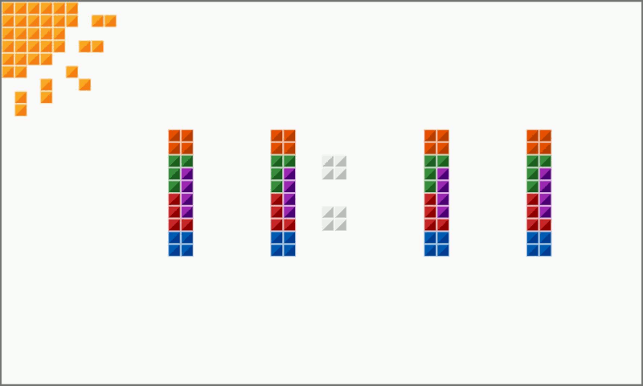
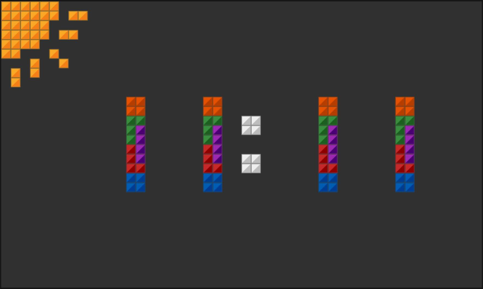
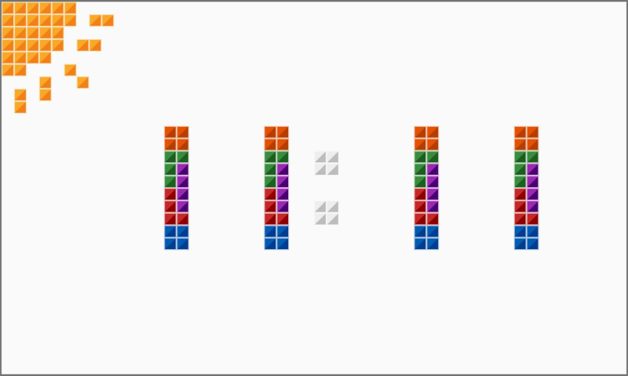

# Tetris Time

This app is my contribution to the flutter clock challenge based on the digital clock example.
It has a light theme and a dark theme and uses weather-data to show the conditions.

Made with <3 in Herne by Michael Jentsch with support by Merlin Jentsch and Klaudia Jentsch